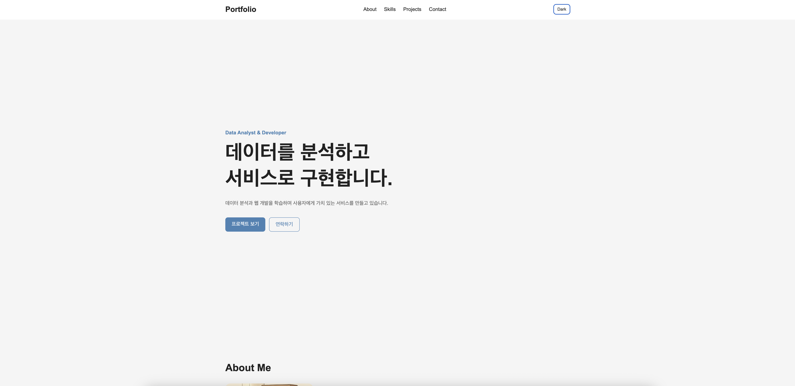
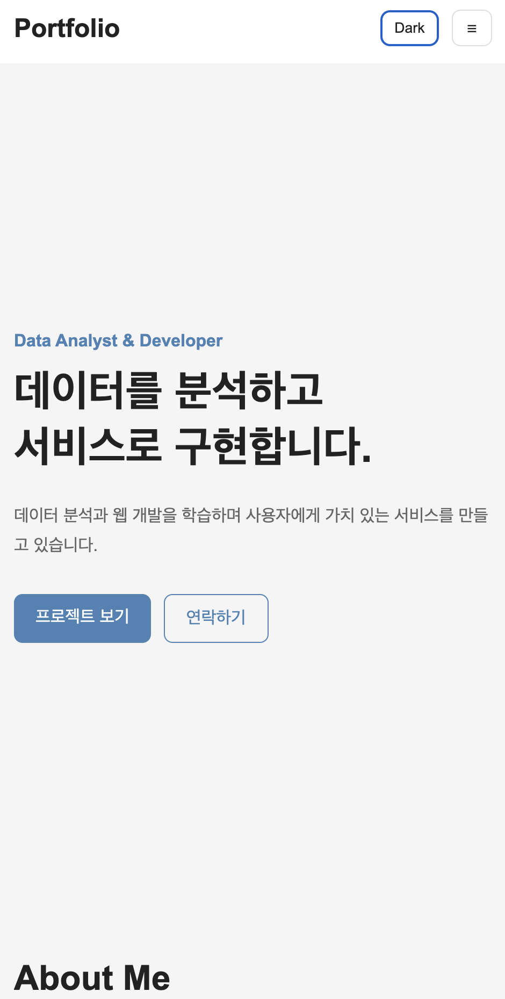
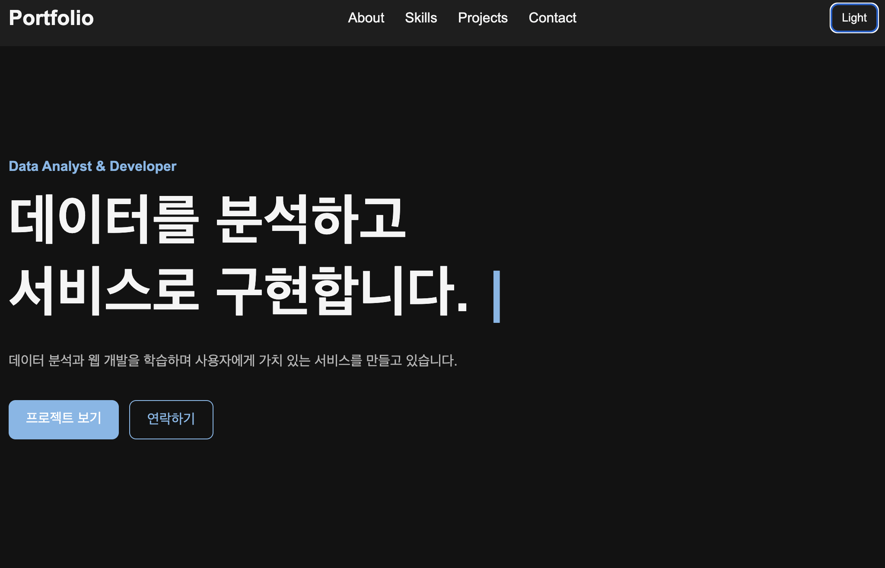

# Portfolio Website

[Live Demo](https://aromadsh.github.io/choonsik/) | [GitHub Repository](https://github.com/aromadsh/choonsik)

순수 HTML, CSS, JavaScript를 사용하여 처음부터 구현한 반응형 포트폴리오 웹사이트입니다.

프레임워크나 UI 라이브러리를 사용하지 않고 DOM 조작, 이벤트 처리, 상태 관리, 비동기 통신 등 웹 프론트엔드의 기본 동작 원리를 직접 구현하는 것을 목표로 개발했습니다.

GitHub REST API를 연동하여 실제 Repository 데이터를 동적으로 렌더링하며, 사용자 이벤트에 따라 상태를 변경하고 화면을 다시 렌더링하는 구조를 적용했습니다.


## Overview

이 프로젝트는 React와 같은 프론트엔드 프레임워크를 사용하기 전에 브라우저의 기본 동작 원리를 이해하기 위해 제작했습니다.

주요 학습 목표는 다음과 같습니다.

- Semantic HTML을 활용한 문서 구조 설계
- Flexbox와 Grid를 이용한 반응형 레이아웃
- DOM 선택 및 조작
- addEventListener 기반 이벤트 처리
- 이벤트 → 상태 변경 → DOM 업데이트 흐름 구현
- localStorage를 이용한 상태 유지
- Intersection Observer를 활용한 스크롤 인터랙션
- fetch와 async/await 기반 REST API 통신
- API Loading, Success, Error, Empty 상태 관리
- JavaScript ES6 문법과 배열 메서드 활용


## Preview

### Desktop



### Mobile



### Dark Mode




## Features

| Feature | Description |
| --- | --- |
| Responsive Design | 모바일 퍼스트 방식으로 768px, 1024px 브레이크포인트를 적용했습니다. |
| Semantic HTML | header, nav, main, section, article, footer를 활용하여 페이지 구조를 구성했습니다. |
| Hamburger Menu | 모바일 환경에서 메뉴를 열고 닫을 수 있습니다. |
| Smooth Scroll | Navigation 및 CTA 클릭 시 해당 Section으로 부드럽게 이동합니다. |
| Scroll Top | 스크롤 300px 이상에서 페이지 상단 이동 버튼이 표시됩니다. |
| Dynamic Header | 스크롤 60px 이상에서 Header 스타일이 변경됩니다. |
| Dark Mode | 사용자가 Light와 Dark Theme을 직접 전환할 수 있습니다. |
| Theme Persistence | 선택한 Theme을 localStorage에 저장하여 새로고침 후에도 유지합니다. |
| System Theme | 저장된 Theme이 없으면 prefers-color-scheme을 이용하여 시스템 Theme을 감지합니다. |
| Scroll Animation | Intersection Observer를 활용하여 Section 진입 시 애니메이션을 실행합니다. |
| Form Validation | 이름, 이메일, 메시지 필수값 및 이메일 형식을 검증합니다. |
| GitHub API | GitHub REST API를 호출하여 Repository 목록을 동적으로 출력합니다. |
| API State | Loading, Success, Error, Empty 상태를 각각 UI로 표현합니다. |
| Project Filter | Repository의 Language 정보를 기반으로 프로젝트를 필터링합니다. |
| Typing Effect | Hero 영역의 문장을 JavaScript로 한 글자씩 출력합니다. |
| Email Contact | EmailJS REST API를 이용하여 Contact 메시지를 실제 이메일로 전송합니다. |


## Tech Stack

### Frontend

- HTML5
- CSS3
- JavaScript ES6+

### Browser APIs

- DOM API
- Fetch API
- Intersection Observer API
- Web Storage API
- matchMedia API
- Form Validation

### External APIs

- GitHub REST API
- EmailJS REST API

### Deployment

- Git
- GitHub
- GitHub Pages


## How It Works

이 프로젝트에서는 주요 기능을 다음과 같은 흐름으로 구현했습니다.

```text
User Event
    ↓
State Change
    ↓
Render Function
    ↓
DOM Update